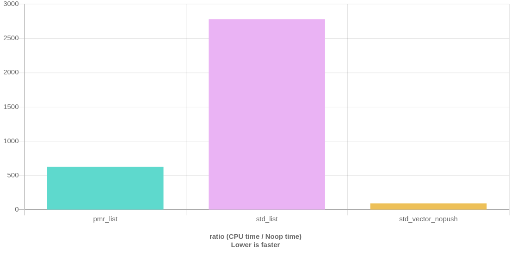
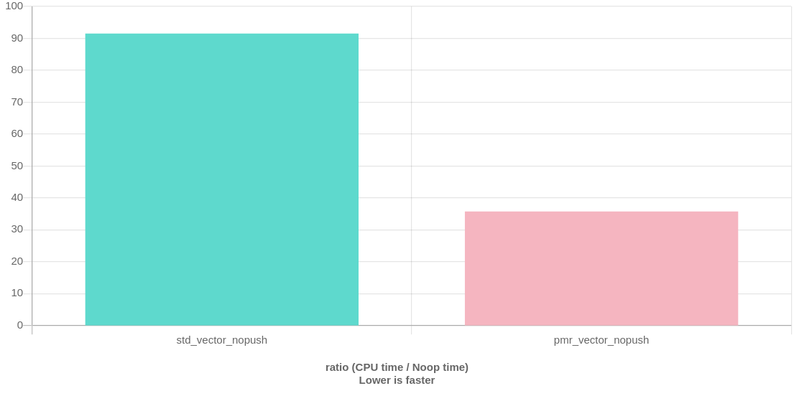
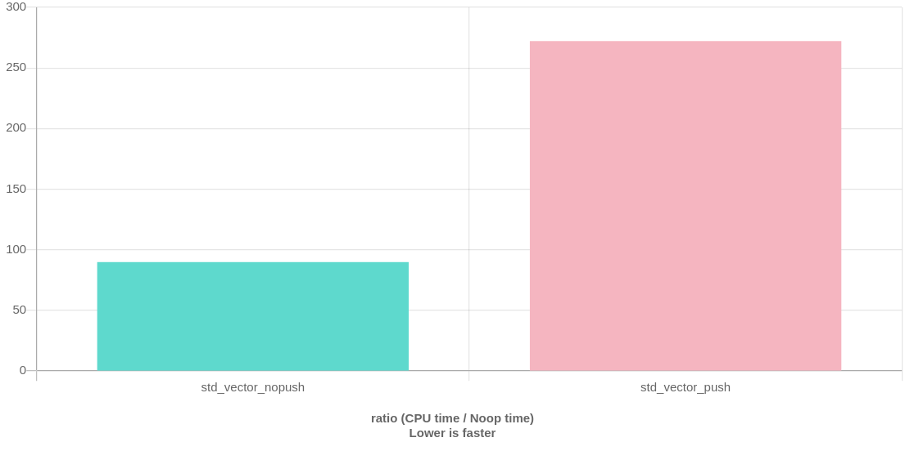
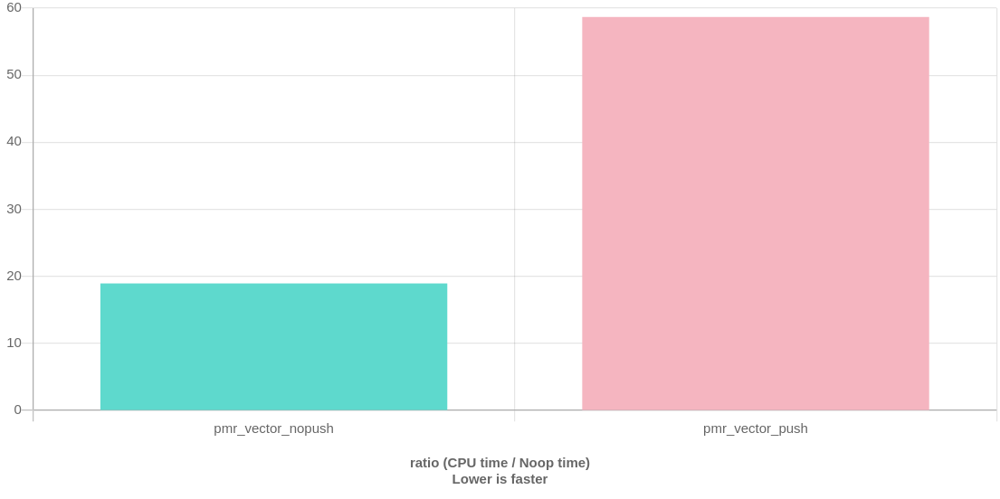
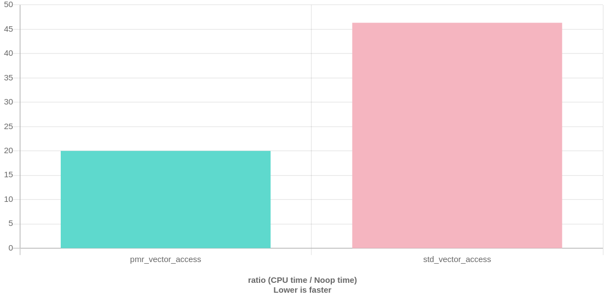

# Description
**A new branch for PMR Implementation and research.**

- [Description](#description)
- [Research and Comparision](#research-and-comparision)
  * [std::pmr::polymorphic_allocator (C++17) vs std:: (Pre C++17)](#std--pmr--polymorphic-allocator--c--17--vs-std----pre-c--17-)
    + [Memory resources <memory_resource> under std::pmr (C++17)](#memory-resources--memory-resource--under-std--pmr--c--17-)
    + [A bit more about..](#a-bit-more-about)
      - [monotonic_buffer_resource](#monotonic-buffer-resource)
      - [synchronized_pool_resource](#synchronized-pool-resource)
      - [unsynchronized_pool_resource](#unsynchronized-pool-resource)
    + [Benchmarks](#benchmarks)
      - [PMR or regular? (1)](#pmr-or-regular---1-)
      - [PMR or regular? (2)](#pmr-or-regular---2-)
      - [Push pop on std?](#push-pop-on-std-)
      - [push pop on pmr?](#push-pop-on-pmr-)
      - [vec[i]= 20; ?](#vec-i---20---)
- [Components](#components)
- [Compile](#compile)


# Research and Comparision 
## std::pmr::polymorphic_allocator (C++17) vs std:: (Pre C++17)

### Memory resources <memory_resource> under std::pmr (C++17)
Definitions and resources can be found [here](https://en.cppreference.com/w/cpp/memory).

The class template *std::pmr::polymorphic_allocator* is an Allocator which exhibits different allocation behavior depending upon the *std::pmr::memory_resource* from which it is constructed.

| Class Name  | Desciprtion  |
| ------------- | ------------- |
| memory_resource  | an abstract interface for classes that encapsulate memory resources   |
| synchronized_pool_resource | a thread-safe std::pmr::memory_resource for managing allocations in pools of different block sizes   |
| unsynchronized_pool_resource | a thread-unsafe std::pmr::memory_resource for managing allocations in pools of different block sizes |
| monotonic_buffer_resource | a special-purpose std::pmr::memory_resource that releases the allocated memory only when the resource is destroyed | 

The goal is to understand these, test them and try to create the custom static buffer allocator for our use case.

### A bit more about..
#### monotonic_buffer_resource
The class std::pmr::monotonic_buffer_resource is a special-purpose memory resource class *that releases the allocated memory only when the resource is destroyed*. It is intended for very fast memory allocations in situations where memory is used to build up a few objects and then is released all at once.

monotonic_buffer_resource can be constructed with an initial buffer. If there is no initial buffer, or if the buffer is exhausted, additional buffers are obtained from an upstream memory resource supplied at construction. The size of buffers obtained follows a geometric progression.

monotonic_buffer_resource is not thread-safe. 

#### synchronized_pool_resource
The class std::pmr::synchronized_pool_resource is a **general-purpose memory** resource class with the following properties:

    - It owns the allocated memory and frees it on destruction, even if deallocate has not been called for some of the allocated blocks.
    - It consists of a collection of pools that serves request for different block sizes. Each pool manages a collection of chunks that are then divided into blocks of uniform size.
    - Calls to do_allocate are dispatched to the pool serving the smallest blocks accommodating the requested size.
    Exhausting memory in the pool causes the next allocation request for that pool to allocate an additional chunk of memory from the upstream allocator to replenish the pool. The chunk size obtained increases geometrically.
    - Allocations requests that exceed the largest block size are served from the upstream allocator directly.
    The largest block size and maximum chunk size may be tuned by passing a std::pmr::pool_options struct to its constructor. 

synchronized_pool_resource may be accessed from multiple threads without external synchronization, and may have thread-specific pools to reduce synchronization costs. If the memory resource is only accessed from one thread, *unsynchronized_pool_resource* is more efficient. 

#### unsynchronized_pool_resource
Just like *synchronized_pool_resource* but it cannot be accessed from multiple threads simultaneously.

### Benchmarks 
Results can also be found at https://quick-bench.com/ from Benchmark.cpp 

Uncomment/Comment to bench.research-and-comparisionmore assembly code._

**To compile C++17 + GCC 9.1 are _required_.**

#### PMR or regular? (1)



monotonic_buffer_resource is noticeably faster !

#### PMR or regular? (2)

Definied in header <vector\deque> since C++17
```
namespace pmr {
    template <class T>
    using vector = std::vector<T, std::pmr::polymorphic_allocator<T>>;
}

namespace pmr {
    template <class T>
    using deque = std::deque<T, std::pmr::polymorphic_allocator<T>>;
}
```

TEST CASE: Create two vectors using both _pmr_ and regular _std_. 

You guessed it, _pmr_ is faster. :+1:

#### Push pop on std?

```
    //Create a regular vector / pmr vector
    ...

    vec1.push_back(10);
    vec1.push_back(10);

    vec1.pop_back();
    vec1.pop_back();
```
... and its effect on speed.

#### push pop on pmr?



Almost the same runtime/CPU time ratio. Of course, the effect on _pmr_ is much less noticeable than on _std_.

#### vec[i]= 20; ?


_pmr_ is still faster. There is almost a (x2.3) diff between the two cases.

# Components
Include pmr_allocator and use the custom_resource class.

To use _::pmr_ on a a specific container, you need to first set a pool, pass that pool as monotonic_buffer_resource, and then pass the resource to a given container (vector).

_Note the use of pmr::vector here._ 

```
  std::byte buffer[512]; 
  custom_resource resource;
  std::pmr::monotonic_buffer_resource pool{std::data(buffer), std::size(buffer), &resource};
  std::pmr::vector<std::pmr::vector<int>> outer(&pool);
```

# Compile 
To compile C++17 and GCC9.1 or above are required.
